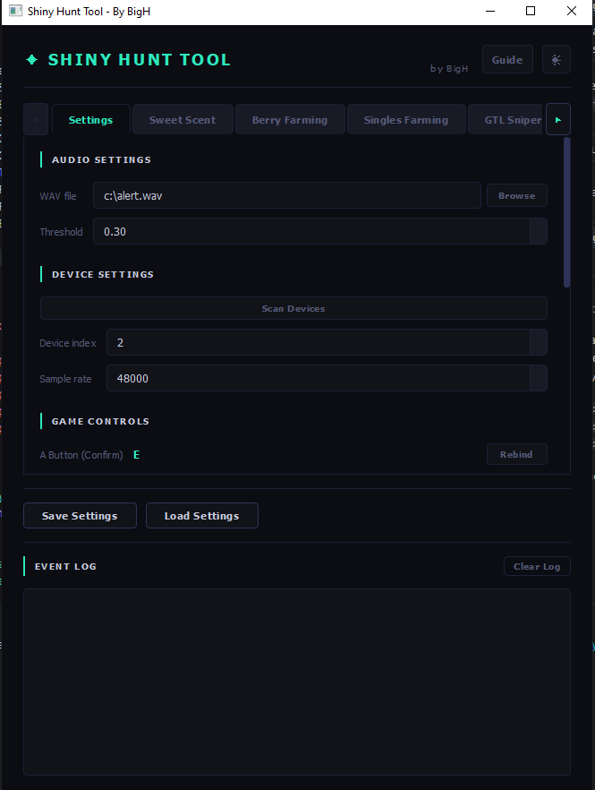
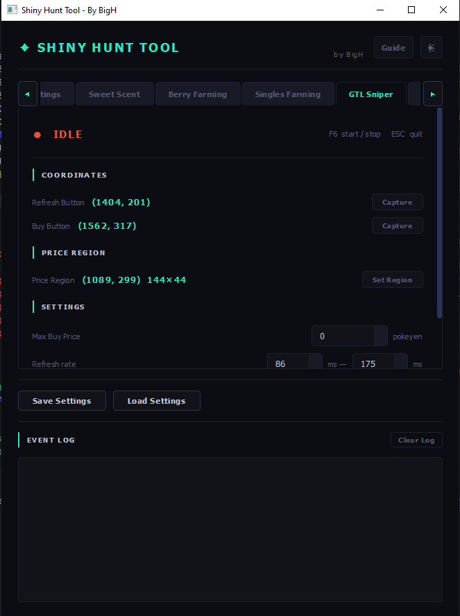
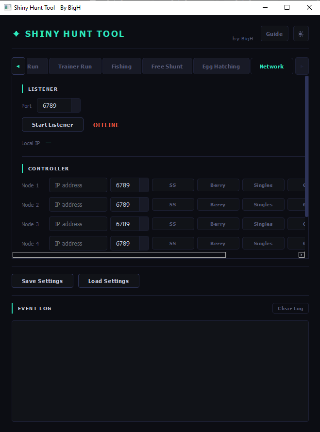

# BH Tools — Game Automation Tool

A PyQt5 desktop application for automating shiny hunting and GTL price sniping. Macros inject keyboard and mouse input via the **Interception** kernel-level driver. An audio listener runs in parallel — when it detects the shiny encounter sound, it stops the macro and fires a Discord webhook notification.

---

## Features

| Mode | Status |
|---|---|
| Sweet Scent | Full |
| Berry Farming | Full (Mistralton / Shrine / Single Patch / Complete Farm) |
| Singles Farming | Full |
| GTL Sniper | Full |
| Gym Run | Placeholder |
| Trainer Run | Placeholder |
| Fishing | Placeholder |
| Free Shunt | Placeholder |
| Network Control | Full (controller + listener, up to 4 nodes) |

- **Audio shiny detection** — cross-correlates live audio against a WAV template; stops the macro and alerts you instantly. **Requires a game sound mod** that replaces the shiny encounter sound with a unique audio cue — the included `alert.wav` is the sound the tool listens for, so your mod must use that same sound
- **Discord notifications** — optional webhook alert on shiny detection with a test button
- **Rebindable hotkeys** — all 8 macro toggle keys and all in-game keys (Sweet Scent move, A button, Water, Repel, Map) are rebindable from the UI
- **Multi-device network control** — run BH Tools on multiple machines simultaneously; one machine acts as the controller and sends start/stop commands to up to 4 remote farm nodes over TCP (port 6789). Each machine can also run as a listener/farm node, receiving commands from the controller. Supports Sweet Scent, Berry Farming, Singles Farming, and GTL Sniper remotely
- **Dark / Light theme** toggle
- **Save / Load settings** — full config persisted to JSON
- **GTL price sniping** — OCR reads the price region, compares against your max price, and auto-buys

---

## Requirements

- Windows 10/11
- Python 3.11
- [Interception driver](https://github.com/oblitum/Interception) installed (kernel-level input injection)
- Tesseract OCR (required for GTL Sniper)

### Python dependencies

```
PyQt5
sounddevice
scipy
numpy
interception (interception-python)
pynput
requests
pytesseract
Pillow
```

Install all at once:

```bash
pip install PyQt5 sounddevice scipy numpy interception-python pynput requests pytesseract Pillow
```

---

## Installation

1. Install the **Interception driver** — download and install it from the [official Interception GitHub page](https://github.com/oblitum/Interception). Run the installer as Administrator
2. Install **Tesseract OCR** and make sure it's on your PATH (required for GTL Sniper only)
3. Clone or download this repo
4. Install Python dependencies (see above)
5. Run:

```bash
python main.py
```

---

## Usage

### Audio detection — game mod required

The audio detection works by listening to your system audio and cross-correlating it against the included `alert.wav` template. For this to work, **the shiny encounter sound in-game must match `alert.wav`**.

This means you need a game sound mod that replaces the default shiny encounter sound with the same audio as `alert.wav`. Without the mod, the tool will not detect shinies via audio.

Steps:
1. Install the sound mod for your game that replaces the shiny encounter sound
2. Ensure the replacement sound matches the included `alert.wav`
3. Set your audio input device in the Settings tab so the tool can hear the game audio

> If you want to use a different sound, replace `alert.wav` with your own WAV file and point the WAV file setting to it — as long as the in-game sound and the WAV file match, detection will work.

### First-time setup

1. Go to the **Settings** tab
2. Set your **audio device** index (click Scan Devices to find it)
3. Set your **WAV file** path (default `alert.wav` is included)
4. Configure your **in-game keys** (Sweet Scent key, A button)
5. Set your **hotkeys** for each macro mode (defaults: F9–F2)
6. Click **Save Settings**

### Running a macro

- Press the assigned hotkey (or use the UI) to **toggle** any macro on/off
- The status dot on each tab shows IDLE / RUNNING / SHINY
- Audio detection runs continuously while any macro is active — it will auto-stop and alert you on a shiny

### GTL Sniper setup

1. Open GTL in-game
2. In the **GTL Sniper** tab, click **Capture** next to Refresh Button — hover over the refresh button in-game within 3 seconds
3. Repeat for Buy Button
4. Click **Set Region** and drag over the price text area
5. Set your **Max Buy Price** (0 = don't buy, just snipe for detection)
6. Toggle the macro on

### Multi-device network setup

BH Tools can control multiple machines over your local network.

**On each farm machine (listener):**
1. Open the **Network** tab
2. Set your port (default `6789`)
3. Click **Start Listener** — it will show `LISTENING`
4. Click **Detect** to find the machine's local IP, note it down
5. If connections are refused, run this in an admin terminal:
   ```
   netsh advfirewall firewall add rule name=BH-Tools-Listener dir=in action=allow protocol=TCP localport=6789
   ```

**On the controller machine:**
1. Open the **Network** tab → **Controller** section
2. Enter the IP and port for each farm node (up to 4)
3. Click **SS / Berry / Singles / GTL** to start that macro on the remote machine, or **Stop** to stop it
4. The status label next to each node shows `OK` or `FAILED` after each command

### Berry Farming setup

1. Go to the **Berry Farming** tab
2. Select your **farm size** (Mistralton / Shrine / Single Patch / Complete Farm)
3. Select your **mode** (Plant & Water / Water Only / Pick Up)
4. For Complete Farm: click **Capture** next to Fly Location and hover over your fly destination within 3 seconds
5. Toggle the macro on

---

## Configuration

Settings are saved to `config.json` via the **Save Settings** button. You can also load any JSON config file with **Load Settings**. The file is auto-generated — do not edit it manually.

Key settings:

| Key | Default | Description |
|---|---|---|
| `threshold` | `0.3` | Audio detection sensitivity (0.01–1.0, lower = more sensitive) |
| `device` | `2` | Audio input device index |
| `samplerate` | `48000` | Audio sample rate |
| `hotkey_sweet_scent` | `F9` | Toggle hotkey for Sweet Scent |
| `hotkey_berry` | `F8` | Toggle hotkey for Berry Farming |
| `hotkey_singles` | `F7` | Toggle hotkey for Singles Farming |
| `hotkey_gtl` | `F6` | Toggle hotkey for GTL Sniper |

---

## Project Structure

```
shiny_hunt/
├── main.py                  Entry point — wires everything together
├── core.py                  Central coordinator, audio detection, macro management
├── hotkeys.py               Global rebindable hotkey listener (pynput)
├── notifications.py         Discord webhook integration
├── sweet_scent.py           Sweet Scent macro
├── berry_farming.py         Berry Farming macro
├── singles_farming.py       Singles Farming macro
├── gtl_sniper.py            GTL Sniper macro
├── egg_hatching.py          Egg Hatching macro
├── gym_run.py               Gym Run (placeholder)
├── trainer_run.py           Trainer Run (placeholder)
├── fishing.py               Fishing (placeholder)
├── free_shunt.py            Free Shunt (placeholder)
├── alert.wav                Shiny encounter audio template
├── config.json              User settings (auto-generated)
└── ui/
    ├── main_window.py       Main application window
    ├── stylesheet.py        Theme colours and Qt CSS
    ├── guide_window.py      In-app guide window
    ├── region_selector.py   Fullscreen drag-to-select overlay
    └── tabs/
        ├── settings_tab.py
        ├── sweet_scent_tab.py
        ├── berry_tab.py
        ├── singles_tab.py
        ├── gtl_tab.py
        ├── egg_hatching_tab.py
        └── ...
```

---

## Building an EXE

You can package the app into a standalone executable using [PyInstaller](https://pyinstaller.org/):

```bash
pip install pyinstaller
py -3.11 -m PyInstaller --onefile main.py
```

---

## Discord Notifications

1. Create a Discord webhook in your server (Channel Settings → Integrations → Webhooks)
2. In the **Settings** tab, enable notifications and paste your webhook URL
3. Click **Test** to verify it works
4. Save settings

When a shiny is detected, a message is sent to the webhook with the detection score.

---

## Notes

- All delays have configurable min/max ranges — randomised variance helps avoid detection
- Debug mode is available on each tab for verbose logging (not persisted between sessions)
- The Interception driver requires a one-time install with admin rights; without it, no input injection will work
- GTL Sniper requires Tesseract OCR to be installed and on PATH

---

## Screenshots






